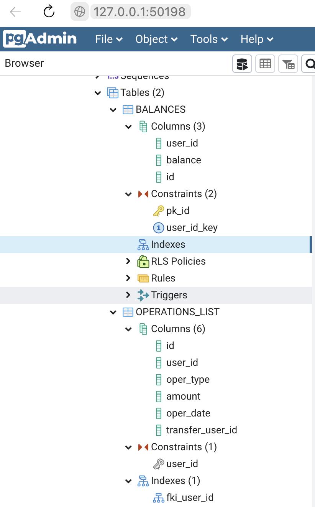

#	Реализовать REST API по работе с банковским счетом.
##	1. Постановка задачи

Необходимо реализовать REST API по работе с банковским счетом.
 
Поддерживаются следующие операции:
* Узнать баланс по ID пользователя;
* Снятие заданной суммы с баланса пользователя;
* Пополнение баланса на заданную сумму;
* Отобразить список операций за выбранный период;
* Перевести заданную сумму другому пользователю.

## 2. Каким образом работать с проектом? 
* Фреймворк для сборки проекта – Maven

## 3. Список основных классов проекта
Пакет java.com.operations, список классов:
* OperationsController - контроллер, отвечающий за точки доступа в приложение

Пакет java.com.operations.dto, список классов DTO:
* GetBalanceRequest - класс, соответствующий запросу баланса пользователя
* GetBalanceResponse - класс, соответствующий ответу на запрос баланса пользователя
* TakeMoneyRequest - класс, соответствующий запросу на снятие средств с баланса пользователя
* TakeMoneyResponse - класс, соответствующий ответу на запрос снятия средств с баланса пользователя
* PutMoneyRequest - класс, соответствующий запросу на пополнение баланса пользователя
* PutMoneyResponse - класс, соответствующий ответу на запрос на пополнение баланса пользователя
* ShortOperation - класс, соответствующий операции в ответе на запрос получения операций пользователя за промежуток времени 
* GetOperationListRequest - класс, соответствующий запросу на получение списка операций пользователя за промежуток времени
* GetOperationListResponse - класс, соответствующий ответу на запрос на получение списка операций пользователя за промежуток времени

Пакет java.com.operations.entity, список классов:
* Operation - класс, соответствующие по структуре таблице OPERATIONS_LIST

Пакет java.com.operations.repository
* BalanceRepository - класс, содержащий DAO для работы с БД ATM_OPERATIONS

Пакет java.com.operations.service
* BalanceService - класс, содержащий сервисы работы с балансом клиента

Пакет java.com.operations.utils
* ErrorText - класс, содержащий текстовки ошибок

## 3. Структура таблиц БД
